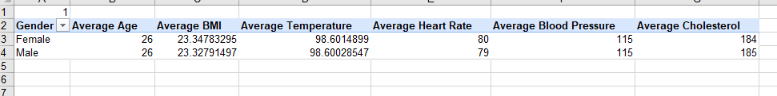
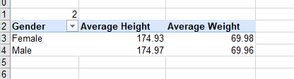
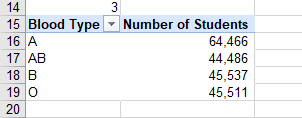
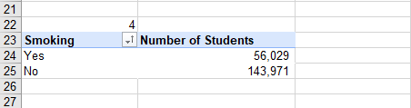
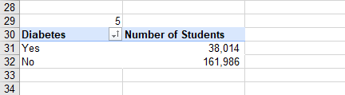
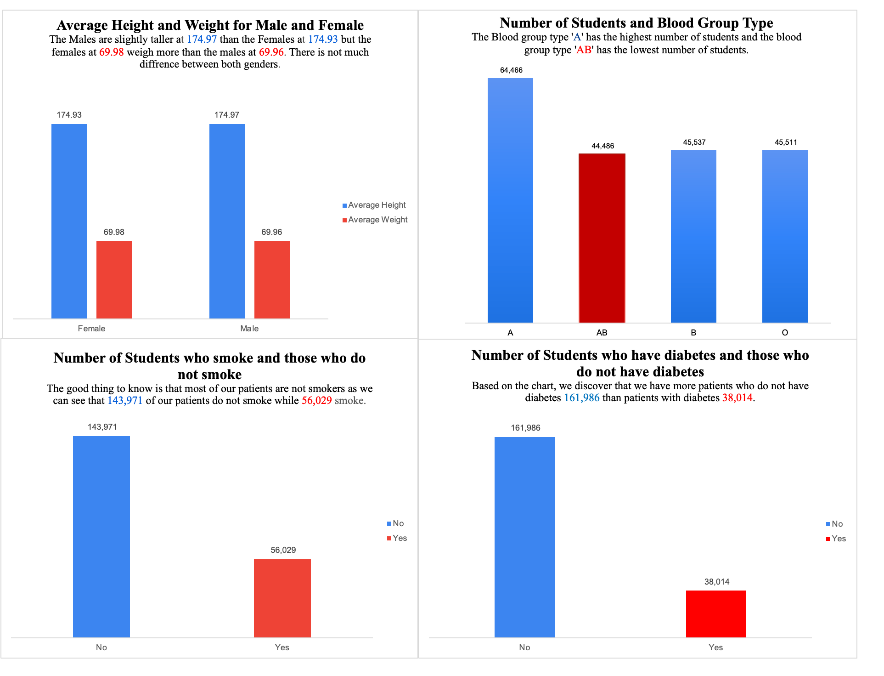

# Analysing-Medical-Records-using-Pivot-Tables
## Introduction

This is my fourth task on data analysis using an Excel spreadsheet. In this analysis, Pivot Tables were used to analyze patients' medical records in a hospital. The data provided was incomplete but had to do some data cleaning to replace and fill up and empty cells in the data. The first table provided was incomplete data with empty cells and can be seen in the file called **medical_students_dataset.csv**. Then I performed some data cleaning in order to replace empty cells with values which can be seen in the file named **medical_students_dataset solved.xlsb**.

## Problem Statement
To solve and provide solutions to the following problems and questions.
1. Find the average values for the following for both Males and Females (Age, BMI, Temperature, Heart Rate, Blood Pressure and Cholesterol).
2. Find the average height and weight for both genders which is male and female (in 2 decimal places).
3. Show the number of students across the different blood groups.
4. Show the number of students who smoke and do not smoke.
5. Show the number of students who have diabetes and those who do not have diabetes.

## Skills Demonstrated
1. Data Processing
2. Data Cleaning
3. Use of Fill 
4. Use of Average Function
5. Use of the Go to Special option
6. Pivot Table
7. Data Visualization

## Data Analysis
The original data table provided was incomplete data table because it contained empty cells (rows). The original incomplete data table can be seen under the file section. The file is called **medical_students_dataset.csv**.
Then, in order to correct data and also make sense, I performed some and applied some data cleaning concepts. 
1. For the Student ID column, I used the Fill option where I inputted the values to start from 1 - 200,000 as the original table.
2. For the age, height, weight, BMI, temperature, heart rate, blood pressure, and cholesterol, I used the AVERAGE() function first of all to get the average of them all.
   - Age =AVERAGE(B2:B200001) = 26
   - Height =AVERAGE(D2:D200001) = 174.9471027
   - Weight =AVERAGE(E2:E200001) = 69.97158509
   -  BMI =AVERAGE(G2:G200001) = 23.29157355
   - Temperature =AVERAGE(H2:H200001) = 98.60094788
   - Heart Rate =AVERAGE(I2:I200001) = 80
   - Blood Pressure =AVERAGE(J2:J200001) = 115
   - Cholesterol =AVERAGE(K2:K200001) = 184
 3. After getting the average for age, height, weight, BMI, temperature, heart rate, blood pressure, and cholesterol, I used the average value to replace the empty rows in each column
 4. To input the average values into the empty rows of the various columns, I did the following
     - Press Control + G ( for mac users) and F5 (for windows users)
     - Click on Specials
     - Click on Blanks
     - On the first highlighted empty cell, enter desired value(s)
     - Then Press Control + Enter
The cleaned data set can be seen in the files section with the name **medical_students_dataset solved.xlsb**.
After this, I then used Pivot Table to solve and answer the medical questions and problems.

To create a Pivot table, 
- We select the whole table
- Then click on the Insert Tab
- Select Pivot Table
- Choose a new worksheet
- Then, it takes you to a new worksheet.

1. For the first problem, to find average values for males and females with respect to their age, BMI, temperature, heart rate, blood pressure and cholesterol, You drag the Gender into Rows and then drag (age, BMI, temperature, heart rate, blood pressure and cholesterol) into Values. To get the average, right-click on all the columns and change the aggregation from sum to average.

2. For average height and weight for both males and females, drag the gender into Rows and then height and weight into the Values. To get the average, right-click on all the columns and change the aggregation from sum to average.

3. For the number of students across the different blood groups, drag the blood groups into Rows and then gender into the Values.

4. For the number of students who smoke and those who don't smoke, drag the smoking into Rows and then gender into the Values.

5. For the number of students who have diabetes and those who don't have diabetes, drag the diabetes into Rows and then gender into the Values.

The visuals below show and explain better our findings and solution to the problems 2 - 5 we are trying to solve which is our problem statement 2 - 5.

## Conclusion
This is my fourth data analysis task using data to tell a story. Carrying out this analysis was made so easy with the use of the Pivot Table. As long as you know which field name to put into the Filters, Columns, Rows and Values and you put them into the section.

